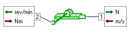

The first port requires a linear velocity in m/s
as an input and computes a force in N as output. The second port requires a torque in Nm as an
input and computes a rotary velocity in rev/min as output.

RACK50 will have the same external variables, but two internal variables. The additional two
being the displacement of the rack and the angular position of the pinion.
